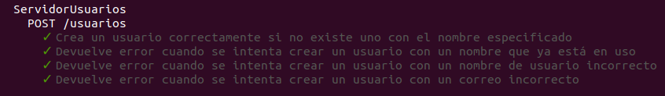

# shop-safe

Repositorio con el proyecto realizado en la asignatura Cloud Computing del Máster en Ingeniería Informática por la Universidad de Granada.

## Problema
Hoy día hay muchas personas que desean realizar compras en línea. También existe una gran cantidad de tiendas cuya fiabilidad desconocen. Los usuarios quisieran conocer las opiniones de otras personas que ya han realizado compras en una determinada tienda para saber si esta es de fiar. Por otro lado, las tiendas quisieran poder defenderse públicamente y solicitar más información a los clientes con el fin de mejorar el servicio. Se desea desarrollar un sistema que permita a los clientes leer y publicar opiniones sobre tiendas y que las tiendas puedan responder a dichas opiniones.

## Cómo ejecutar los test usando Docker

* Clonar el repositorio
* Teniendo Docker instalado ejecutar en el directorio del proyecto `docker build -t januszewskimar/shop-safe`
* Ejecutar en el mismo directorio `docker run -v "$(pwd)/src":/shop-safe/src januszewskimar/shop-safe`

## Justificación técnica del framework elegido para el microservicio

Para elegir un framework para mi proyecto, he consultado varias páginas para ver las mejores opciones. Finalmente, me he quedado con los que más se mencionan: Express, Koa y Hapi. He mirado las características, códigos de ejemplo y resultó que en todos se programaba de manera parecida. Es cierto que Hapi tiene el mejor rendimiento, pero he optado por Express, dado que es más sencillo que los otros, se escribe menos código y es más intuitivo. Además, es el framework más popular, hay muchos recursos en Internet para aprender, resolver errores y tiene una gran comunidad de usuarios que ofrecen soporte. Además, se ofrece una documentación detallada para Express.

## Diseño en general del API, las rutas (o tareas), tests y documentación de todo, justificando como se ajustan a las historias de usuario, de forma que reflejen correctamente un diseño por capas que desacopla la lógica de negocio del API.

He creado dos API: [ServidorUsuarios](src/ServidorUsuarios.ts) y [ServidorOpiniones](src/ServidorOpiniones.ts). En las funciones del API se llama a funciones del controlador correspondiente, lo que desacopla la lógica de negocio de la API.

En [ServidorUsuarios](src/ServidorUsuarios.ts) he incluido la funcionalidad de registrar un usuario:

* POST /usuarios - HU1 - Como usuario, quiero registrarme en el sistema

Esta petición permite crear un nuevo usuario. En el cuerpo se envían todos los datos del usuario (nombre de usuario, correo electrónico, nombre y apellidos). Esta petición devuelve 200 si el usuario se ha creado y 400 en el caso de que ya exista un usuario con el nombre de usuario especificado, el nombre de usuario o el correo electrónico sean incorrectos. La función en la API llama a una función en [ControladorUsuarios](src/ControladorUsuarios.ts) que devuelve una excepción correspondiente en caso de error ([ExcepcionUsuarioYaExiste](src/ExcepcionUsuarioYaExiste.ts), [ExcepcionNombreUsuarioIncorrecto](src/ExcepcionNombreUsuarioIncorrecto.ts) o [ExcepcionCorreoIncorrecto](src/ExcepcionCorreoIncorrecto.ts)]). En cualquier caso se devuelve el motivo del error en la petición. Para testar la ruta he creado tres pruebas para un caso en el que la petición debería devolver una respuesta de éxito y 3 pruebas para las respuestas de error explicadas anteriormente:

En ServidorOpiniones he creado varias peticiones de distintos tipos.

* POST /tiendas/:tienda/opiniones - HU2 - Como usuario, quiero añadir una opinión sobre una tienda

Esta petición permite añadir una nueva opinión sobre una tienda. Especificamos en la ruta el nombre de la tienda y en el cuerpo del mensaje enviamos el nombre de usuario, el título de la opinión, la valoración numérica y la descripción. Si la valoración numérica cumple los requisitos (un número entero entre 1 y 5), recibimos una respuesta de tipo 200. En caso contrario, se recibe una respuesta de tipo 400. La función del API llama a una función en [ControladorOpiniones](src/ControladorOpiniones.ts) que puede lanzar una excepción [ExcepcionValoracionNumericaIncorrecta](src/ExcepcionValoracionNumericaIncorrecta.ts) y de esta manera se detecta una petición incorrecta. Los test que he preparado son los siguientes:

* GET /tiendas/:tienda/opiniones - HU5 - Como usuario, quiero conocer las opiniones sobre una tienda

Se especifica el nombre de la tienda en la ruta y no se especifica nada en el cuerpo. Se devuelve la lista de opiniones sobre la tienda especificada en formato JSON y con el tipo de respuesta 200. En el [controlador](src/ControladorOpiniones.ts) se ejecuta la función getOpinionesNombreTienda.

* GET /tiendas/:tienda/valoracion-media - HU6 - Como usuario, quiero conocer la valoración media de una tienda

En esta petición se especifica el nombre de la tienda en la ruta y no se especifica nada en el cuerpo. En caso de exisitr opiniones sobre la tienda especificada, se devuelve un número indicando la valoración media en una respuesta de tipo 200. En caso contrario, se devuelve una respuesta de tipo 406 indicando el motivo. La función de la API llama a getValoracionMediaTienda del [controlador](src/ControladorOpiniones.ts) que devuelve un número o lanza una excepción [ExcepcionNoHayOpiniones](src/ExcepcionNoHayOpiniones.ts). Se han preparado los siguientes test:

* DELETE /tiendas/:tienda/opiniones/:id - HU4 - Como usuario, quiero eliminar una opinión sobre una tienda

Para eliminar una opinión indicamos el nombre de la tienda en la ruta y el id de la opinión sin tener que enviar nada en el cuerpo. Si existe una opinión relacionada con la tienda y con el id especificado, se devuelve una respuesta de tipo 200. En otro caso, se devuelve una respuesta de tipo 404. La función llama a eliminarOpinion que devuelve true si existe la opinión y en este caso se suprime o false en caso de que no exista.

* PUT /tiendas/:tienda/opiniones/:id/respuesta - HU8 - Como administrador de una tienda, quiero contestar a una opinión de un usuario, HU9 - Como administrador de una tienda, quiero modificar una respuesta a una opinión de un usuario

Esta petición sirve para introducir o modificar una respuesta a una opinión sobre una tienda. En la ruta se especifica el nombre de la tienda y el identificador de la opinión. En el cuerpo se envia el contenido de la respuesta. La función llama a publicarRespuesta del [ControladorOpiniones](src/ControladorOpiniones.ts) que puede devolver la excepción [ExcepcionOpinionNoExiste](src/ExcepcionOpinionNoExiste.ts) en caso de que no exista la opinión especificada (código de error 404). En otro caso se devuelve la respuesta de tipo 200.

* DELETE /tiendas/:tienda/opiniones/:id/respuesta - HU10 Como administrador de una tienda, quiero eliminar una respuesta a una opinión de un usuario

Mediante esta petición se suprime una respuesta a una opinión sobre una tienda. En la ruta se especifica el nombre de la tienda y el identificador de la opinión. En el cuerpo no se envia nada. La función llama a eliminarRespuestaOpinion del [ControladorOpiniones](src/ControladorOpiniones.ts) que puede devolver la excepción [ExcepcionOpinionNoExiste](src/ExcepcionOpinionNoExiste.ts) o [ExcepcionRespuestaOpinionNoExiste](src/ExcepcionRespuestaOpinionNoExiste.ts) en cuyo caso se devuelve la respuesta con código 404. En otro caso la respuesta es de tipo 200.

## Avance en el proyecto

### Opinion

En [Opinion](src/Opinion.ts) se ha incluido el identificador numérico que junto con la tienda la identifica unívocamente. Además, se han incluido los métodos getRespuesta, setRespuesta y tieneRespuesta de tipo booleano.

Ficheros:
* [Opinion](src/Opinion.ts)

### ControladorOpiniones

En [ControladorOpiniones](src/ControladorOpiniones.ts) se ha modificado el método addOpinion de manera que asigna el identificador buscando el número mayor entre los de la tienda indicada y asigna a la opinión el número siguiente para que no se repitan. 

En el controlador se ha incluido el método publicarOpinion que recibe datos de la opinión, el nombre de la tienda y el nombre de usuario y crea objetos del administrador de la tienda, de la tienda y del usuario. Esto se hace, puesto que los microservicios en este momento no están conectados entre sí. Posteriormente, se pedirían los datos de la tienda al servicio de tiendas y los datos del usuario al servicio de usuarios.

Se ha creado el método publicarRespuesta que recibe el nombre de la tienda, el identificador de la opinión y el contenido de la respuesta. Este método busca la opinión correspondiente y añade una respuesta la opinión existe pero todavía no hay una respuesta. En caso de que la opinión exista y haya una respuesta, se actualiza con el nuevo contenido. En caso de que no exista la opinión, se lanza una excepción ExcepcionOpinionNoExiste.

Además, se ha creado un método eliminarOpinion que recibe el nombre de la tienda y el identificador de la opinión. Si la opinión existe, se suprime y se devuelve true. En otro caso se devuelve false.

El método eliminarRespuestaOpinion busca la opinión correspondiente mediante el nombre de la tienda y el identificador de la opinión especificados. Si no se encuentra la opinión, se lanza la excepción ExcepcionOpinionNoExiste. Si existe la opinión pero no contiene una respuesta, se lanza una excepción ExcepcionRespuestaOpinionNoExiste. En otro caso, se elimina la respuesta de la opinión.

Ficheros:
* [ControladorOpiniones](src/ControladorOpiniones.ts)
* [Test de ControladorOpiniones](src/test/ControladorOpiniones.ts)

### Excepciones

Se han creado las siguientes excepciones:
* [ExcepcionOpinionNoExiste](src/ExcepcionOpinionNoExiste.ts)
* [ExcepcionRespuestaOpinionNoExiste](src/ExcepcionRespuestaOpinionNoExiste.ts)
* [ExcepcionValoracionNumericaIncorrecta](src/ExcepcionValoracionNumericaIncorrecta.ts)

## Enlaces a la documentación
* [Configuración de git y GitHub](docs/config-git-github.md)
* [Arquitectura](docs/arquitectura.md)
* [Herramientas](docs/herramientas.md)
* [Herramientas para las pruebas](docs/herramientas-pruebas.md)
* [Historias de usuario](https://github.com/januszewskimar/CC-proyecto/blob/main/docs/historias-usuario.md)
* [Planificación](https://github.com/januszewskimar/CC-proyecto/blob/main/docs/planificacion.md)
* [Contendores](docs/contenedores.md)
* [Integración continua y gestor de tareas](docs/integracion-continua-gestor-tareas.md)
