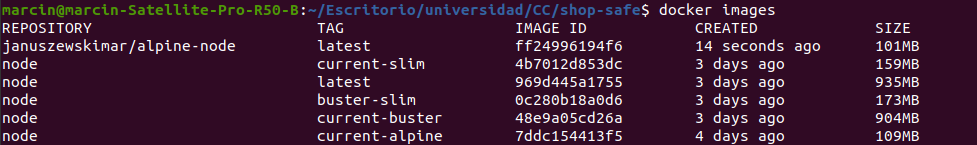
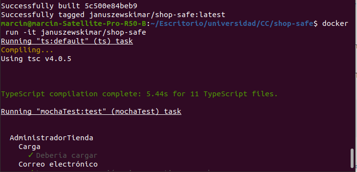
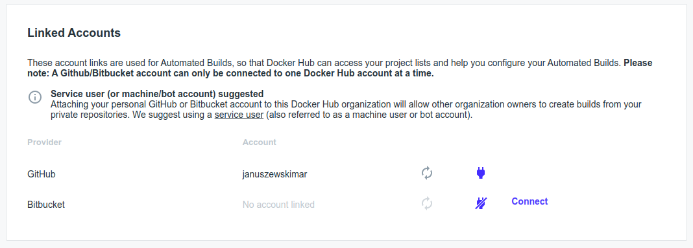
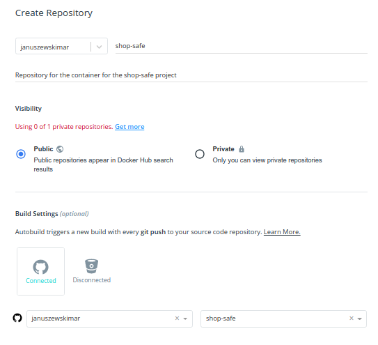
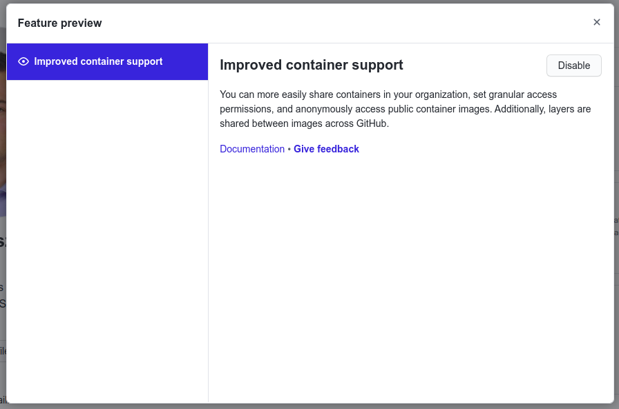
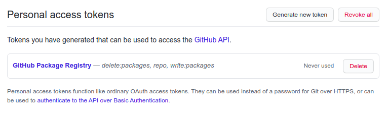
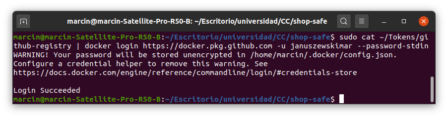
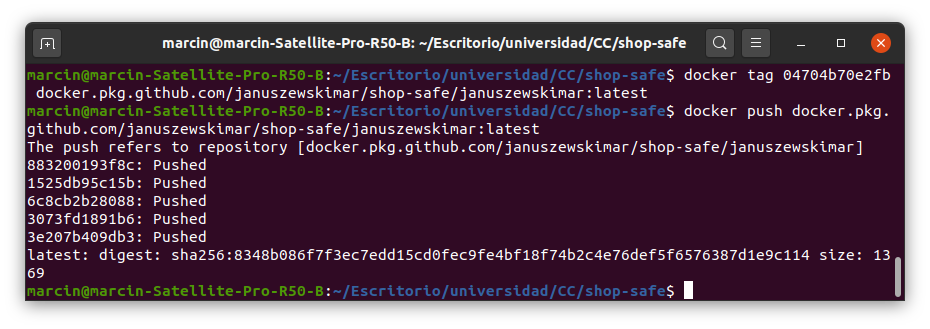

# shop-safe
Repositorio con el proyecto realizado en la asignatura Cloud Computing del Máster en Ingeniería Informática por la Universidad de Granada.

## Problema
Hoy día hay muchas personas que desean realizar compras en línea. También existe una gran cantidad de tiendas cuya fiabilidad desconocen. Los usuarios quisieran conocer las opiniones de otras personas que ya han realizado compras en una determinada tienda para saber si esta es de fiar. Por otro lado, las tiendas quisieran poder defenderse públicamente y solicitar más información a los clientes con el fin de mejorar el servicio. Se desea desarrollar un sistema que permita a los clientes leer y publicar opiniones sobre tiendas y que las tiendas puedan responder a dichas opiniones.

## Selección del gestor de tareas

Para JavaScript existen dos gestores de tareas principales - Grunt y Gulp. He optado por Grunt, ya que es más fácil y tiene una comunidad de usuarios más grande, por lo cual, se puede solucionar problemas más rápidamente. Cabe destacar que Grunt es mejor para proyectos pequeños y Gulp para proyectos más grandes. Grunt es más lento que Gulp, ya que usa ficheros intermedios y el otro realiza todas las operaciones en la RAM. Sin embargo, por todas las características anteriores, he elegido Grunt.

## Configuración del gestor de tareas

Se ha configurado Grunt para que al ejecutarlo sin parámetros (`grunt`) compile los ficheros y ejecute los test. Lo mismo se alcanza ejecutando grunt test. Si se quiere compilar los ficheros sin ejecutar los test, se ejecuta `grunt compile`. La configuración se encuentra en [este fichero](Gruntfile.js).

## Selección de la biblioteca de aserciones

Para JavaScript existen varias bibliotecas de aserciones como Chai, Must.js o Should.js. En biblioteca estándar de JavaScript también existe una biblioteca de aserciones. He optado por Chai, puesto que es intuitiva pudiendo utilizarse comandos como assert, expect o should para especificar aserciones.

## Selección del marco de pruebas

Los marcos de pruebas para JavaScript más populares son Mocha y Jasmine. Las dos herramientas son muy similares pero he elegido Mocha, ya que es más popular. Ambas se integran fácilmente con Node.js y permiten el testeo asíncrono. Las dos herramientas permiten realizar el TDD pero en Mocha es más fácil el BDD (en este proyecto se seguirá TDD, ya que no se va a desarrollar el front end). Jasmine contiene una biblioteca de aserciones y Mocha no, por lo cual, es necesario instalar una o usar la estándar de JavaScript (en este caso no supone un problema).

## Clases desarrolladas

* [Usuario.ts](/src/Usuario.ts)
* [AdministradorTienda.ts](/src/AdministradorTienda.ts)
* [Tienda.ts](/src/Tienda.ts)
* [Opinion.ts](/src/Opinion.ts)
* [ControladorOpiniones.ts](/src/ControladorOpiniones.ts)
* [ValidacionDatos.ts](/src/ValidacionDatos.ts)

Tests:
* [Usuario.ts](/src/test/Usuario.ts)
* [AdministradorTienda.ts](/src/test/AdministradorTienda.ts)
* [Tienda.ts](/src/test/Tienda.ts)
* [Opinion.ts](/src/test/Opinion.ts)
* [ControladorOpiniones.ts](/src/test/ControladorOpiniones.ts)

## Cómo compilar el proyecto y ejecutar los test

* Clonar el repositorio
* Teniendo npm instalado ejecutar `npm install -g grunt-cli` y después `npm install`
* Para compilar los ficheros y ejecutar los test hay que ejecutar `grunt` o `grunt test`. Para compilar sin ejecutar los test se ejecuta `grunt compile`

## Selección de imagen base

Se va a elegir la imagen base entre las siguientes opciones:
* imagen oficial de Node.js - latest (stretch)
* imagen oficial de Node.js - current-slim (stretch-slim)
* imagen oficial de Node.js - alpine
* imagen oficial de Node.js - buster
* imagen oficial de Node.js - buster-slim
* imagen propia - Alpine

Como se puede ver, la de menor tamaño es la propia, por lo cual, la voy a usar. Para elaborarla, he reutilizado la configuración oficial de alpine quitando la parte correspondiente a la instalación de yarn. No he usado apk add, ya que en el repositorio de Alpine no están las versiones de Node.js y npm más recientes. Además, en la implementación que he elegido es posible seleccionar la versión deseada fácilmente editando la variable de entorno.

## Dockerfile

En la imagen propia, respecto la configuración oficial, he eliminando la parte correspondiente a la instalación de yarn, ya que no lo necesito. He añadido las instrucciones de copia del fichero de Grunt y de los ficheros de código fuente. He creado un fichero [.dockerignore](.dockerignore) en el que se ignoran las carpetas node_modules y los ficheros con la extensión .js y .js.map dentro de la carpeta src (el fichero Gruntfile.js no se ignora). Además, en el Dockerfile he añadido las instrucciones de instalación global de Grunt y de instalación local de las dependencias de package.json. Las instrucciones de RUN se ejecutan en un bloque para evitar la creación de capas innecesarias. Después de instalarse los módulos, los paquetes que eran necesarios para la instalación y no van a ser necesarios más adelante se desinstalan. De la misma manera se eliminan los ficheros temporales. Está añadida también la etiqueda de encargado del mantenimiento. El comando CMD ejecuta grunt test. El fichero se puede ver [aquí](Dockerfile).

El correcto funcionamiento del contenedor se puede ver en la imagen que viene a continuación:

## Docker Hub

El contenedor se ha subido a Docker Hub. Para hacerlo, me he registrado en dicha página y he enlazado la cuenta con la de GitHub:

Después he creado un repositorio y lo he enlazado con el de GitHub:

He configurado las construcciones automatizadas:

## GitHub Package Registry

He utilizado GitHub Package Registry como registro alternativo, ya que es gratuito para repositorios públicos, y además, el repositorio de código está en el mismo servicio que el contenedor y están enlazados.

Primero he activado la funcionalidad Improved Container Support en la página de GitHub:

Después he creado un token para poder realizar gestiones de contenedores:

Más tarde he iniciado sesión en docker con el token previamente creado:

Al final puse un tag correspondiente al contenedor y lo subí:

## Avance del proyecto

Se han implementado excepciones propias en vez de objetos de la clase Error que se usaban antes:
* [ExcepcionNombreUsuarioIncorrecto.ts](/src/ExcepcionNombreUsuarioIncorrecto.ts)
* [ExcepcionCorreoIncorrecto.ts](/src/ExcepcionCorreoIncorrecto.ts)
* [ExcepcionTelefonoIncorrecto.ts](/src/ExcepcionTelefonoIncorrecto.ts)

Se han empleado las excepciones antes mencionadas en los siguientes clases:
* [Usuario.ts](/src/Usuario.ts)
* [AdministradorTienda.ts](/src/AdministradorTienda.ts)
* [Tienda.ts](/src/Tienda.ts)

Y en los test correspondientes:
* [Usuario.ts](/src/test/Usuario.ts)
* [AdministradorTienda.ts](/src/test/AdministradorTienda.ts)
* [Tienda.ts](/src/test/Tienda.ts)

Además, se ha añadido la funcionalidad de contestar a una opinión de un cliente:
* [RespuestaOpinion.ts](/src/RespuestaOpinion.ts)
* [ControladorOpiniones.ts](/src/ControladorOpiniones.ts)

Y en los test correspondientes:
* [RespuestaOpinion.ts](/src/test/RespuestaOpinion.ts)
* [ControladorOpiniones.ts](/src/test/ControladorOpiniones.ts)

Adicionalmente, se ha implementado la funcionalidad de conocer la valoración media de una tienda:
* [ControladorOpiniones.ts](/src/ControladorOpiniones.ts)
* [ExcepcionNoHayOpiniones.ts](/src/ExcepcionNoHayOpiniones.ts)

Y el test de dicha funcionalidad:
* [ControladorOpiniones.ts](/src/test/ControladorOpiniones.ts)

## Enlaces a la documentación
* [Configuración de git y GitHub](https://github.com/januszewskimar/CC-proyecto/blob/main/docs/config-git-github.md)
* [Arquitectura](https://github.com/januszewskimar/CC-proyecto/blob/main/docs/arquitectura.md)
* [Herramientas](https://github.com/januszewskimar/CC-proyecto/blob/main/docs/herramientas.md)
* [Historias de usuario](https://github.com/januszewskimar/CC-proyecto/blob/main/docs/historias-usuario.md)
* [Planificación](https://github.com/januszewskimar/CC-proyecto/blob/main/docs/planificacion.md)
