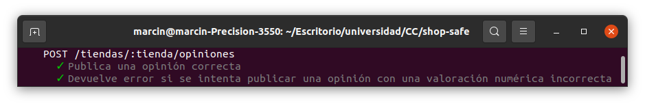

# shop-safe

Repositorio con el proyecto realizado en la asignatura Cloud Computing del Máster en Ingeniería Informática por la Universidad de Granada.

## Problema
Hoy día hay muchas personas que desean realizar compras en línea. También existe una gran cantidad de tiendas cuya fiabilidad desconocen. Los usuarios quisieran conocer las opiniones de otras personas que ya han realizado compras en una determinada tienda para saber si esta es de fiar. Por otro lado, las tiendas quisieran poder defenderse públicamente y solicitar más información a los clientes con el fin de mejorar el servicio. Se desea desarrollar un sistema que permita a los clientes leer y publicar opiniones sobre tiendas y que las tiendas puedan responder a dichas opiniones.

## Cómo ejecutar los test usando Docker

* Clonar el repositorio
* Teniendo Docker instalado ejecutar en el directorio del proyecto `docker build -t januszewskimar/shop-safe`
* Ejecutar en el mismo directorio `docker run -v "$(pwd)/src":/shop-safe/src januszewskimar/shop-safe`

## Justificación técnica del framework elegido para el microservicio

Para elegir un framework para mi proyecto, he consultado varias páginas para ver las mejores opciones. Finalmente, me he quedado con los que más se mencionan: Express, Koa y Hapi. He mirado las características, códigos de ejemplo y resultó que en todos se programaba de manera parecida. Es cierto que Hapi tiene el mejor rendimiento, pero he optado por Express, dado que es más sencillo que los otros, se escribe menos código y es más intuitivo. Además, es el framework más popular, hay muchos recursos en Internet para aprender, resolver errores y tiene una gran comunidad de usuarios que ofrecen soporte. Además, se ofrece una documentación detallada para Express.

## Diseño del API, las rutas y test

He creado cuatro API (una por cada microservicio): [RutasUsuarios](src/usuarios/RutasUsuarios.ts), [RutasAdministradoresTiendas](src/administradores-tiendas/RutasAdministradoresTiendas.ts), [RutasTiendas](src/tiendas/RutasTiendas.ts) y [RutasOpiniones](src/opiniones/RutasOpiniones.ts). En las funciones de la API se llama a las funciones del controlador correspondientes, lo que desacopla la lógica de negocio de la API. Para realizar pruebas de las rutas creadas, he creado [test de RutasUsuarios](src/usuarios/test/RutasUsuarios.ts), [test de RutasAdministradoresTiendas](src/administradores-tiendas/test/RutasAdministradoresTiendas.ts), [test de RutasTiendas](src/tiendas/test/RutasTiendas.ts) y [test de RutasOpiniones](src/opiniones/test/RutasOpiniones.ts).

### Rutas de Usuarios

En [RutasUsuarios](src/usuarios/RutasUsuarios.ts) he incluido la petición de registrar un usuario y he programado [test de esta](src/usuarios/test/RutasUsuarios.ts).

#### POST /usuarios

Historias de usuario:

* [HU1 - Como usuario, quiero registrarme en el sistema](https://github.com/januszewskimar/shop-safe/issues/7)

Esta petición sirve para crear un nuevo usuario. En el cuerpo se envían todos los datos del usuario (nombre de usuario, correo electrónico, nombre y apellidos). Esta petición devuelve 200 si el usuario se ha creado junto con el objeto creado y 409 en el caso de que ya exista un usuario con el nombre de usuario especificado y 400 si el nombre de usuario o el correo electrónico son incorrectos. La función en la API llama al método addUsuario de [ControladorUsuarios](src/usuarios/ControladorUsuarios.ts) que devuelve una excepción correspondiente en caso de error ([ExcepcionUsuarioYaExiste](src/excepciones/ExcepcionUsuarioYaExiste.ts), [ExcepcionNombreUsuarioIncorrecto](src/excepciones/ExcepcionNombreUsuarioIncorrecto.ts) o [ExcepcionCorreoIncorrecto](src/excepciones/ExcepcionCorreoIncorrecto.ts)). En cualquier caso se devuelve el motivo del error en la petición. Para testar la ruta he creado tres pruebas para un caso en el que la petición debería devolver una respuesta de éxito y 3 pruebas para las respuestas de error explicadas anteriormente:

### Rutas de Administradores de Tiendas

En [RutasAdministradoresTiendas](src/administradores-tiendas/RutasAdministradoresTiendas.ts) he incluido la petición de registrar un administrador y he programado [test de esta](src/administradores-tiendas/test/RutasAdministradoresTiendas.ts).

#### POST /administradores-tiendas

Historias de usuario:

* [HU7 - Como administrador de una tienda, quiero registrarla en el sistema](https://github.com/januszewskimar/shop-safe/issues/13)

Esta petición sirve para crear un nuevo administrador de tienda. En el cuerpo se envían todos los datos del administrador (nombre de usuario, correo electrónico, nombre y apellidos). Esta petición devuelve 200 junto con el objeto creado si el administrador se ha creado y 409 en el caso de que ya exista un administrador con el nombre de usuario especificado y 400 si el nombre de usuario o el correo electrónico son incorrectos. La función en la API llama al método addAdministrador de [ControladorAdministradoresTiendas](src/administradores-tiendas/ControladorAdministradoresTiendas.ts) que devuelve una excepción correspondiente en caso de error ([ExcepcionUsuarioYaExiste](src/excepciones/ExcepcionUsuarioYaExiste.ts), [ExcepcionNombreUsuarioIncorrecto](src/excepciones/ExcepcionNombreUsuarioIncorrecto.ts) o [ExcepcionCorreoIncorrecto](src/excepciones/ExcepcionCorreoIncorrecto.ts)). En cualquier caso se devuelve el motivo del error en la petición. Para testar la ruta he creado tres pruebas para un caso en el que la petición debería devolver una respuesta de éxito y 3 pruebas para las respuestas de error explicadas anteriormente:

### Rutas de Tiendas

En [RutasTiendas](src/tiendas/RutasTiendas.ts) he incluido la petición de crear una tienda y he programado [test de esta](src/tiendas/test/RutasTiendas.ts).

#### POST /tiendas

Historias de usuario:

* [HU7 - Como administrador de una tienda, quiero registrarla en el sistema](https://github.com/januszewskimar/shop-safe/issues/13)

Esta petición sirve para crear una nueva tienda. En el cuerpo se envían todos los datos de la tienda (nombre, dirección, teléfono y nombre de usuario del administrador). Esta petición devuelve 200 si la tienda se ha creado junto con el objeto creado que contiene el identificador asignado y 400 si el teléfono es incorrecto. La función en la API llama al método addTienda de [ControladorTiendas](src/tiendas/ControladorTiendas.ts) que devuelve una excepción correspondiente en caso de error ([ExcepcionTelefonoIncorrecto](src/excepciones/ExcepcionTelefonoIncorrecto.ts)). En tal caso se devuelve el motivo del error en la petición. Para testar la ruta he creado dos pruebas para un caso en el que la petición debería devolver una respuesta de éxito y una prueba en caso de proporcionar un número de teléfono incorrecto:

### Rutas de Opiniones

En [RutasOpiniones](src/opiniones/RutasOpiniones.ts) he creado varias peticiones de distintos tipos. He creado [test de cada una de ellas](src/opiniones/test/RutasOpiniones.ts).

#### POST /tiendas/:tienda/opiniones

Historias de usuario:
* [HU2 - Como usuario, quiero añadir una opinión sobre una tienda](https://github.com/januszewskimar/shop-safe/issues/8)

Esta petición permite añadir una nueva opinión sobre una tienda. Especificamos en la ruta el identificador de la tienda y en el cuerpo del mensaje enviamos el nombre de usuario, el título de la opinión, la valoración numérica y la descripción. Si la valoración numérica cumple los requisitos (un número entero entre 1 y 5), recibimos una respuesta de tipo 200. En caso contrario, se recibe una respuesta de tipo 400. La función de la API llama al método publicarOpinion de [ControladorOpiniones](src/opiniones/ControladorOpiniones.ts) que puede lanzar una excepción [ExcepcionValoracionNumericaIncorrecta](src/excepciones/ExcepcionValoracionNumericaIncorrecta.ts) y de esta manera se detectan errores en la petición. Los test que he preparado son los siguientes:

#### GET /tiendas/:tienda/opiniones

Historias de usuario:
* [HU5 - Como usuario, quiero conocer las opiniones sobre una tienda](https://github.com/januszewskimar/shop-safe/issues/11)

Esta petición sirve para obtener todas las opiniones sobre una tienda. Se especifica el identificador de la tienda en la ruta y no se especifica nada en el cuerpo. Se devuelve la lista de opiniones sobre la tienda especificada en formato JSON y con el tipo de respuesta 200. La función en la API llama al método getOpinionesTienda del [controlador](src/opiniones/ControladorOpiniones.ts).

#### GET /tiendas/:tienda/valoracion-media

Historias de usuario:
* [HU6 - Como usuario, quiero conocer la valoración media de una tienda](https://github.com/januszewskimar/shop-safe/issues/12)

Esta petición permite obtener la valoración media de una tienda. Se especifica el identificador de la tienda en la ruta y no se especifica nada en el cuerpo. En caso de exisitir opiniones sobre la tienda especificada, se devuelve un número indicando la valoración media en una respuesta de tipo 200. En caso contrario, se devuelve una respuesta de tipo 404 indicando el motivo. La función de la API llama a getValoracionMediaTienda del [controlador](src/opiniones/ControladorOpiniones.ts) que devuelve un número o lanza una excepción [ExcepcionNoHayOpiniones](src/excepciones/ExcepcionNoHayOpiniones.ts). Se han preparado los siguientes test:

#### DELETE /tiendas/:tienda/opiniones/:id

Historias de usuario:
* [HU4 - Como usuario, quiero eliminar una opinión sobre una tienda](https://github.com/januszewskimar/shop-safe/issues/10)

Esta petición sirve para eliminar una opinión. Para eliminar una opinión indicamos el identificador de la tienda en la ruta y el id de la opinión sin tener que enviar nada en el cuerpo. Si existe una opinión relacionada con la tienda y con el id especificado, se devuelve una respuesta de tipo 200. En otro caso, se devuelve una respuesta de tipo 404. La función de la API llama a eliminarOpinion del [controlador](src/opiniones/ControladorOpiniones.ts) que devuelve true si existe la opinión y en este caso se suprime o false en caso de que no exista. Las pruebas se pueden ver en la siguiente captura de pantalla.

#### PUT /tiendas/:tienda/opiniones/:id/respuesta

Historias de usuario:
* [HU8 - Como administrador de una tienda, quiero contestar a una opinión de un usuario](https://github.com/januszewskimar/shop-safe/issues/14)
* [HU9 - Como administrador de una tienda, quiero modificar una respuesta a una opinión de un usuario](https://github.com/januszewskimar/shop-safe/issues/15)

Esta petición permite introducir o modificar una respuesta a una opinión sobre una tienda. En la ruta se especifica el identificador de la tienda y el identificador de la opinión. En el cuerpo se envia el contenido de la respuesta. La función de la API llama a publicarRespuesta del [ControladorOpiniones](src/opiniones/ControladorOpiniones.ts) que puede devolver la excepción [ExcepcionOpinionNoExiste](src/excepciones/ExcepcionOpinionNoExiste.ts) en caso de que no exista la opinión especificada (código de error 404). Si no se captura una excepción, se devuelve la respuesta de tipo 200. Los test creados se ven a continuación.

#### DELETE /tiendas/:tienda/opiniones/:id/respuesta

Historias de usuario:
* [HU10 - Como administrador de una tienda, quiero eliminar una respuesta a una opinión de un usuario](https://github.com/januszewskimar/shop-safe/issues/16)

Esta petición sirve para eliminar una respuesta a una opinión sobre una tienda. En la ruta se especifica el identificador de la tienda y el identificador de la opinión. En el cuerpo no se envia nada. La función de la API llama a eliminarRespuestaOpinion del [ControladorOpiniones](src/opiniones/ControladorOpiniones.ts) que puede devolver la excepción [ExcepcionOpinionNoExiste](src/excepciones/ExcepcionOpinionNoExiste.ts) o [ExcepcionRespuestaOpinionNoExiste](src/excepciones/ExcepcionRespuestaOpinionNoExiste.ts) en cuyo caso se devuelve la respuesta con código 404. Si no se captura una excepción, la respuesta es de tipo 200. Las pruebas se pueden ver en la siguiente imagen:

## Configuración distribuida y logs

He creado un fichero de configuración para cada API de rutas. En estos ficheros establezco el puerto mediante configuración distribuida y configuro los logs.

* [ServidorUsuarios](src/usuarios/ServidorUsuarios.ts)
* [ServidorAdministradoresTiendas](src/administradores-tiendas/ServidorAdministradoresTiendas.ts)
* [ServidorTiendas](src/tiendas/ServidorTiendas.ts)
* [ServidorOpiniones](src/opiniones/ServidorOpiniones.ts)

### Configuración distribuida

Para implementar la configuración distribuida he elegido etcd3, puesto que es el sistema más popular y dispone de una gran comunidad de usuarios, lo que facilita la resolución de problemas. En los ficheros de configuración primero se intenta obtener el número del puerto mediante etcd. Si no está presente dicha variable, se utiliza la variable de entorno process.env.PORT. Y si esta no está, se utiliza el puerto 8080.

### Logs

Como logger he considerado Morgan y Winston. He elegido el segundo, dado que los dos presentan características similares y el segundo es más popular, por lo que es más fácil obtener soporte de la comunidad de usuarios. He utilizando el middleware express-winston y lo he configurado de manera que se logueen las peticiones.

## Avance en el proyecto

### Historias de usuario

Se han implementado en las rutas todas las historias de usuario planeadas al principio.

### API

Documentadas en la sección anterior.

Ficheros:
* [RutasUsuarios](src/usuarios/RutasUsuarios.ts)
* [Test de RutasUsuarios](src/usuarios/test/RutasUsuarios.ts)
* [ServidorUsuarios](src/usuarios/ServidorUsuarios.ts)
* [RutasAdministradoresTiendas](src/administradores-tiendas/RutasAdministradoresTiendas.ts)
* [Test de RutasAdministradoresTiendas](src/administradores-tiendas/test/RutasAdministradoresTiendas.ts)
* [ServidorAdministradoresTiendas](src/administradores-tiendas/ServidorAdministradoresTiendas.ts)
* [RutasTiendas](src/tiendas/RutasTiendas.ts)
* [Test de RutasTiendas](src/tiendas/test/RutasTiendas.ts)
* [ServidorTiendas](src/tiendas/ServidorTiendas.ts)
* [RutasOpiniones](src/opiniones/RutasOpiniones.ts)
* [Test de RutasOpiniones](src/opiniones/test/RutasOpiniones.ts)
* [ServidorOpiniones](src/opiniones/ServidorOpiniones.ts)

### ControladorOpiniones

En [ControladorOpiniones](src/opiniones/ControladorOpiniones.ts) se ha modificado el método addOpinion de manera que asigna el identificador buscando el número mayor entre los de la tienda indicada y asigna a la opinión el número siguiente para que no se repitan. 

En el [controlador](src/opiniones/ControladorOpiniones.ts) se ha incluido el método publicarOpinion que recibe datos de la opinión, el identificador de la tienda y el nombre de usuario. Crea un objeto Opinion con el tiempo de creación, lo añade a la lista de opiniones asignando el identificador mediante el método addOpinion y devuelve el objeto con el identificador asignado.

Se ha creado el método publicarRespuesta que recibe el identificador de la tienda, el identificador de la opinión y el contenido de la respuesta. Este método busca la opinión correspondiente y añade una respuesta la opinión existe pero todavía no hay una respuesta. En caso de que la opinión exista y haya una respuesta, se actualiza con el nuevo contenido. En caso de que no exista la opinión, se lanza una excepción [ExcepcionOpinionNoExiste](src/excepciones/ExcepcionOpinionNoExiste.ts).

Además, se ha creado un método eliminarOpinion que recibe el nombre de la tienda y el identificador de la opinión. Si la opinión existe, se suprime y se devuelve true. En otro caso se devuelve false.

El método eliminarRespuestaOpinion busca la opinión correspondiente mediante el identificador de la tienda y el identificador de la opinión especificados. Si no se encuentra la opinión, se lanza la excepción [ExcepcionOpinionNoExiste](src/excepciones/ExcepcionOpinionNoExiste.ts). Si existe la opinión pero no contiene una respuesta, se lanza una excepción [ExcepcionRespuestaOpinionNoExiste](src/excepciones/ExcepcionRespuestaOpinionNoExiste.ts). En otro caso, se elimina la respuesta de la opinión.

Ficheros:
* [ControladorOpiniones](src/opiniones/ControladorOpiniones.ts)
* [Test de ControladorOpiniones](src/opiniones/test/ControladorOpiniones.ts)

### ControladorAdministradoresTiendas

Se ha creado el [controlador](src/administradores-tiendas/ControladorAdministradoresTiendas.ts) que contiene el método addAdministrador que recibe un objeto [AdministradorTienda](src/entidades/AdministradorTienda.ts) y lo almacena en caso de que no exista uno ya con el mismo nombre de usuario. En caso de que ya exista, se lanza una excepción [ExcepcionUsuarioYaExiste](src/excepciones/ExcepcionUsuarioYaExiste.ts).

Ficheros:
* [ControladorAdministradoresTiendas](src/administradores-tiendas/ControladorAdministradoresTiendas.ts)
* [Test de ControladorAdministradoresTiendas](src/administradores-tiendas/test/ControladorAdministradoresTiendas.ts)

### ControladorTiendas

Se ha creado el [controlador](src/tiendas/ControladorTiendas.ts) que contiene el método addTienda que recibe un objeto [Tienda](src/entidades/Tienda.ts), le asigna un id y devuelve el objeto con el id asignado.

Ficheros:
* [ControladorTiendas](src/tiendas/ControladorTiendas.ts)
* [Test de ControladorTiendas](src/tiendas/test/ControladorTiendas.ts)

### Excepciones

Se han creado las siguientes excepciones:

* [ExcepcionOpinionNoExiste](src/excepciones/ExcepcionOpinionNoExiste.ts)
* [ExcepcionRespuestaOpinionNoExiste](src/excepciones/ExcepcionRespuestaOpinionNoExiste.ts)
* [ExcepcionValoracionNumericaIncorrecta](src/excepciones/ExcepcionValoracionNumericaIncorrecta.ts)

## Enlaces a la documentación
* [Configuración de git y GitHub](docs/config-git-github.md)
* [Arquitectura](docs/arquitectura.md)
* [Herramientas](docs/herramientas.md)
* [Herramientas para las pruebas](docs/herramientas-pruebas.md)
* [Historias de usuario](https://github.com/januszewskimar/CC-proyecto/blob/main/docs/historias-usuario.md)
* [Planificación](https://github.com/januszewskimar/CC-proyecto/blob/main/docs/planificacion.md)
* [Contendores](docs/contenedores.md)
* [Integración continua y gestor de tareas](docs/integracion-continua-gestor-tareas.md)
