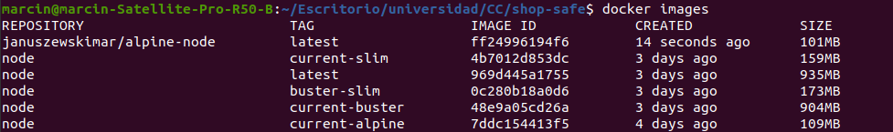
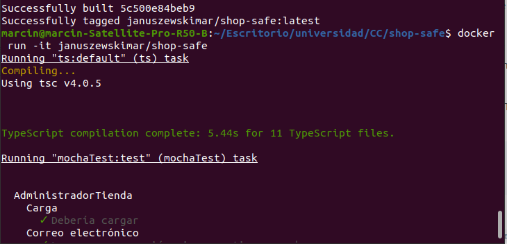
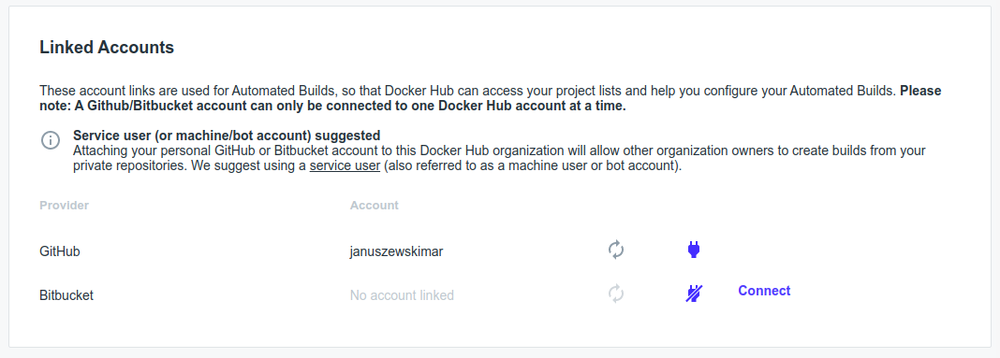
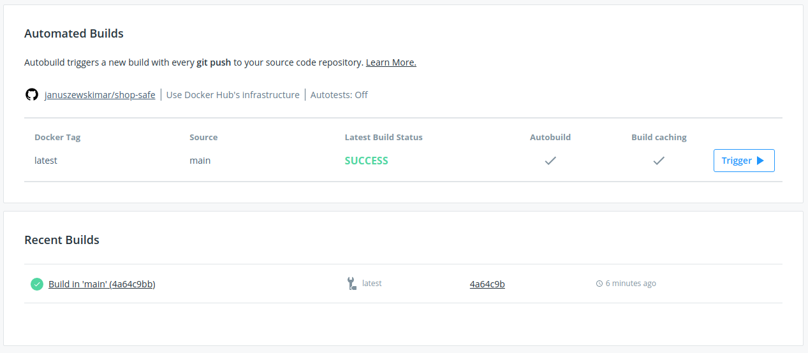
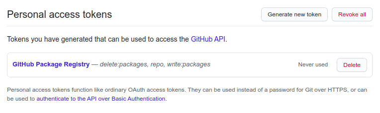
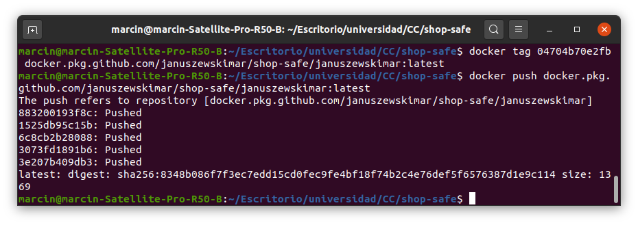

# Contenedores

## Selección de imagen base

Se va a elegir la imagen base entre las siguientes opciones:
* imagen propia - Alpine
* imagen oficial de Node.js - current-slim (stretch-slim)
* imagen oficial de Node.js - latest (stretch)
* imagen oficial de Node.js - buster-slim
* imagen oficial de Node.js - buster
* imagen oficial de Node.js - alpine

Como se puede ver, la de menor tamaño es la propia, por lo cual, la voy a usar. Para elaborarla, he reutilizado la configuración oficial de alpine quitando la parte correspondiente a la instalación de yarn. No he usado apk add, ya que en el repositorio de Alpine no están las versiones de Node.js y npm más recientes. Además, en la implementación que he elegido es posible seleccionar la versión deseada fácilmente editando la variable de entorno.

## Dockerfile

En la imagen propia, respecto la configuración oficial, he eliminando la parte correspondiente a la instalación de yarn, ya que no lo necesito. He añadido las instrucciones de copia del fichero de Grunt y de los ficheros de código fuente. He creado un fichero [.dockerignore](.dockerignore) en el que se ignoran las carpetas node_modules y los ficheros con la extensión .js y .js.map dentro de la carpeta src (el fichero Gruntfile.js no se ignora). Además, en el Dockerfile he añadido las instrucciones de instalación global de Grunt y de instalación local de las dependencias de package.json. Las instrucciones de RUN se ejecutan en un bloque para evitar la creación de capas innecesarias. Después de instalarse los módulos, los paquetes que eran necesarios para la instalación y no van a ser necesarios más adelante se desinstalan. De la misma manera, se eliminan los ficheros temporales. Está añadida también la etiqueda de encargado del mantenimiento. El comando CMD ejecuta grunt test. El fichero se puede ver [aquí](Dockerfile).

El correcto funcionamiento del contenedor se puede ver en la imagen que viene a continuación:

## Docker Hub

El contenedor se ha subido a Docker Hub. Para hacerlo, me he registrado en dicha página y he enlazado la cuenta con la de GitHub:

Después he creado un repositorio y lo he enlazado con el de GitHub:

He configurado las construcciones automatizadas:

## GitHub Package Registry

He utilizado GitHub Package Registry como registro alternativo, ya que es gratuito para repositorios públicos, y además, el repositorio de código está en el mismo servicio que el contenedor y están enlazados.

Primero he activado la funcionalidad Improved Container Support en la página de GitHub:

Después he creado un token para poder realizar gestiones de contenedores:

Más tarde he iniciado sesión en docker con el token previamente creado:

Al final puse un tag correspondiente al contenedor y lo subí:

