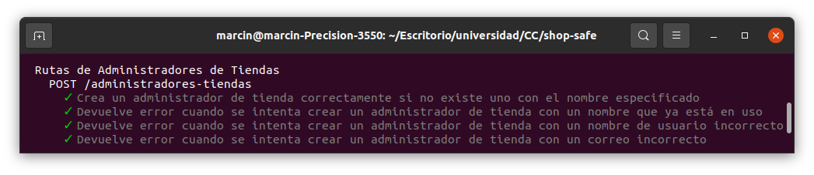
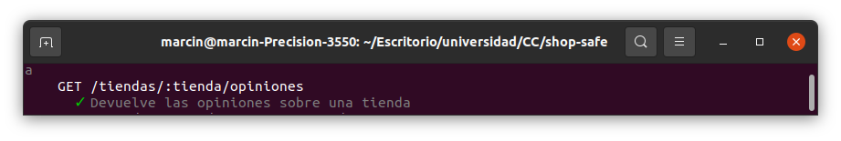
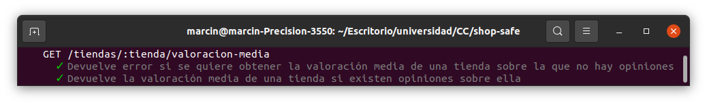
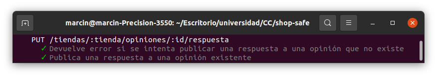

# Microservicios

## Diseño del API, las rutas y test

He creado cuatro API (una por cada microservicio): [RutasUsuarios](src/usuarios/RutasUsuarios.ts), [RutasAdministradoresTiendas](src/administradores-tiendas/RutasAdministradoresTiendas.ts), [RutasTiendas](src/tiendas/RutasTiendas.ts) y [RutasOpiniones](src/opiniones/RutasOpiniones.ts). En las funciones de la API se llama a las funciones del controlador correspondientes, lo que desacopla la lógica de negocio de la API. Para realizar pruebas de las rutas creadas, he creado [test de RutasUsuarios](src/usuarios/test/RutasUsuarios.ts), [test de RutasAdministradoresTiendas](src/administradores-tiendas/test/RutasAdministradoresTiendas.ts), [test de RutasTiendas](src/tiendas/test/RutasTiendas.ts) y [test de RutasOpiniones](src/opiniones/test/RutasOpiniones.ts).

### Rutas de Usuarios

En [RutasUsuarios](src/usuarios/RutasUsuarios.ts) he incluido la petición de registrar un usuario y he programado [test de esta](src/usuarios/test/RutasUsuarios.ts).

#### POST /usuarios

Historias de usuario:

* [HU1 - Como usuario, quiero registrarme en el sistema](https://github.com/januszewskimar/shop-safe/issues/7)

Esta petición sirve para crear un nuevo usuario. En el cuerpo se envían todos los datos del usuario (nombre de usuario, correo electrónico, nombre y apellidos). Esta petición devuelve 200 si el usuario se ha creado junto con el objeto creado y 409 en el caso de que ya exista un usuario con el nombre de usuario especificado y 400 si el nombre de usuario o el correo electrónico son incorrectos. La función en la API llama al método addUsuario de [ControladorUsuarios](src/usuarios/ControladorUsuarios.ts) que devuelve una excepción correspondiente en caso de error ([ExcepcionUsuarioYaExiste](src/excepciones/ExcepcionUsuarioYaExiste.ts), [ExcepcionNombreUsuarioIncorrecto](src/excepciones/ExcepcionNombreUsuarioIncorrecto.ts) o [ExcepcionCorreoIncorrecto](src/excepciones/ExcepcionCorreoIncorrecto.ts)). En cualquier caso se devuelve el motivo del error en la petición. Para testar la ruta he creado tres pruebas para un caso en el que la petición debería devolver una respuesta de éxito y 3 pruebas para las respuestas de error explicadas anteriormente:

### Rutas de Administradores de Tiendas

En [RutasAdministradoresTiendas](src/administradores-tiendas/RutasAdministradoresTiendas.ts) he incluido la petición de registrar un administrador y he programado [test de esta](src/administradores-tiendas/test/RutasAdministradoresTiendas.ts).

#### POST /administradores-tiendas

Historias de usuario:

* [HU7 - Como administrador de una tienda, quiero registrarla en el sistema](https://github.com/januszewskimar/shop-safe/issues/13)

Esta petición sirve para crear un nuevo administrador de tienda. En el cuerpo se envían todos los datos del administrador (nombre de usuario, correo electrónico, nombre y apellidos). Esta petición devuelve 200 junto con el objeto creado si el administrador se ha creado y 409 en el caso de que ya exista un administrador con el nombre de usuario especificado y 400 si el nombre de usuario o el correo electrónico son incorrectos. La función en la API llama al método addAdministrador de [ControladorAdministradoresTiendas](src/administradores-tiendas/ControladorAdministradoresTiendas.ts) que devuelve una excepción correspondiente en caso de error ([ExcepcionUsuarioYaExiste](src/excepciones/ExcepcionUsuarioYaExiste.ts), [ExcepcionNombreUsuarioIncorrecto](src/excepciones/ExcepcionNombreUsuarioIncorrecto.ts) o [ExcepcionCorreoIncorrecto](src/excepciones/ExcepcionCorreoIncorrecto.ts)). En cualquier caso se devuelve el motivo del error en la petición. Para testar la ruta he creado tres pruebas para un caso en el que la petición debería devolver una respuesta de éxito y 3 pruebas para las respuestas de error explicadas anteriormente:

### Rutas de Tiendas

En [RutasTiendas](src/tiendas/RutasTiendas.ts) he incluido la petición de crear una tienda y he programado [test de esta](src/tiendas/test/RutasTiendas.ts).

#### POST /tiendas

Historias de usuario:

* [HU7 - Como administrador de una tienda, quiero registrarla en el sistema](https://github.com/januszewskimar/shop-safe/issues/13)

Esta petición sirve para crear una nueva tienda. En el cuerpo se envían todos los datos de la tienda (nombre, dirección, teléfono y nombre de usuario del administrador). Esta petición devuelve 200 si la tienda se ha creado junto con el objeto creado que contiene el identificador asignado y 400 si el teléfono es incorrecto. La función en la API llama al método addTienda de [ControladorTiendas](src/tiendas/ControladorTiendas.ts) que devuelve una excepción correspondiente en caso de error ([ExcepcionTelefonoIncorrecto](src/excepciones/ExcepcionTelefonoIncorrecto.ts)). En tal caso se devuelve el motivo del error en la petición. Para testar la ruta he creado dos pruebas para un caso en el que la petición debería devolver una respuesta de éxito y una prueba en caso de proporcionar un número de teléfono incorrecto:

### Rutas de Opiniones

En [RutasOpiniones](src/opiniones/RutasOpiniones.ts) he creado varias peticiones de distintos tipos. He creado [test de cada una de ellas](src/opiniones/test/RutasOpiniones.ts).

#### POST /tiendas/:tienda/opiniones

Historias de usuario:
* [HU2 - Como usuario, quiero añadir una opinión sobre una tienda](https://github.com/januszewskimar/shop-safe/issues/8)

Esta petición permite añadir una nueva opinión sobre una tienda. Especificamos en la ruta el identificador de la tienda y en el cuerpo del mensaje enviamos el nombre de usuario, el título de la opinión, la valoración numérica y la descripción. Si la valoración numérica cumple los requisitos (un número entero entre 1 y 5), recibimos una respuesta de tipo 200. En caso contrario, se recibe una respuesta de tipo 400. La función de la API llama al método publicarOpinion de [ControladorOpiniones](src/opiniones/ControladorOpiniones.ts) que puede lanzar una excepción [ExcepcionValoracionNumericaIncorrecta](src/excepciones/ExcepcionValoracionNumericaIncorrecta.ts) y de esta manera se detectan errores en la petición. Los test que he preparado son los siguientes:

#### GET /tiendas/:tienda/opiniones

Historias de usuario:
* [HU5 - Como usuario, quiero conocer las opiniones sobre una tienda](https://github.com/januszewskimar/shop-safe/issues/11)

Esta petición sirve para obtener todas las opiniones sobre una tienda. Se especifica el identificador de la tienda en la ruta y no se especifica nada en el cuerpo. Se devuelve la lista de opiniones sobre la tienda especificada en formato JSON y con el tipo de respuesta 200. La función en la API llama al método getOpinionesTienda del [controlador](src/opiniones/ControladorOpiniones.ts).

#### GET /tiendas/:tienda/valoracion-media

Historias de usuario:
* [HU6 - Como usuario, quiero conocer la valoración media de una tienda](https://github.com/januszewskimar/shop-safe/issues/12)

Esta petición permite obtener la valoración media de una tienda. Se especifica el identificador de la tienda en la ruta y no se especifica nada en el cuerpo. En caso de exisitir opiniones sobre la tienda especificada, se devuelve un número indicando la valoración media en una respuesta de tipo 200. En caso contrario, se devuelve una respuesta de tipo 404 indicando el motivo. La función de la API llama a getValoracionMediaTienda del [controlador](src/opiniones/ControladorOpiniones.ts) que devuelve un número o lanza una excepción [ExcepcionNoHayOpiniones](src/excepciones/ExcepcionNoHayOpiniones.ts). Se han preparado los siguientes test:

#### DELETE /tiendas/:tienda/opiniones/:id

Historias de usuario:
* [HU4 - Como usuario, quiero eliminar una opinión sobre una tienda](https://github.com/januszewskimar/shop-safe/issues/10)

Esta petición sirve para eliminar una opinión. Para eliminar una opinión indicamos el identificador de la tienda en la ruta y el id de la opinión sin tener que enviar nada en el cuerpo. Si existe una opinión relacionada con la tienda y con el id especificado, se devuelve una respuesta de tipo 200. En otro caso, se devuelve una respuesta de tipo 404. La función de la API llama a eliminarOpinion del [controlador](src/opiniones/ControladorOpiniones.ts) que devuelve true si existe la opinión y en este caso se suprime o false en caso de que no exista. Las pruebas se pueden ver en la siguiente captura de pantalla.

#### PUT /tiendas/:tienda/opiniones/:id/respuesta

Historias de usuario:
* [HU8 - Como administrador de una tienda, quiero contestar a una opinión de un usuario](https://github.com/januszewskimar/shop-safe/issues/14)
* [HU9 - Como administrador de una tienda, quiero modificar una respuesta a una opinión de un usuario](https://github.com/januszewskimar/shop-safe/issues/15)

Esta petición permite introducir o modificar una respuesta a una opinión sobre una tienda. En la ruta se especifica el identificador de la tienda y el identificador de la opinión. En el cuerpo se envia el contenido de la respuesta. La función de la API llama a publicarRespuesta del [ControladorOpiniones](src/opiniones/ControladorOpiniones.ts) que puede devolver la excepción [ExcepcionOpinionNoExiste](src/excepciones/ExcepcionOpinionNoExiste.ts) en caso de que no exista la opinión especificada (código de error 404). Si no se captura una excepción, se devuelve la respuesta de tipo 200. Los test creados se ven a continuación.

#### DELETE /tiendas/:tienda/opiniones/:id/respuesta

Historias de usuario:
* [HU10 - Como administrador de una tienda, quiero eliminar una respuesta a una opinión de un usuario](https://github.com/januszewskimar/shop-safe/issues/16)

Esta petición sirve para eliminar una respuesta a una opinión sobre una tienda. En la ruta se especifica el identificador de la tienda y el identificador de la opinión. En el cuerpo no se envia nada. La función de la API llama a eliminarRespuestaOpinion del [ControladorOpiniones](src/opiniones/ControladorOpiniones.ts) que puede devolver la excepción [ExcepcionOpinionNoExiste](src/excepciones/ExcepcionOpinionNoExiste.ts) o [ExcepcionRespuestaOpinionNoExiste](src/excepciones/ExcepcionRespuestaOpinionNoExiste.ts) en cuyo caso se devuelve la respuesta con código 404. Si no se captura una excepción, la respuesta es de tipo 200. Las pruebas se pueden ver en la siguiente imagen:

## Configuración distribuida y logs

He creado un fichero de configuración para cada API de rutas. En estos ficheros establezco el puerto mediante configuración distribuida y configuro los logs.

* [ServidorUsuarios](src/usuarios/ServidorUsuarios.ts)
* [ServidorAdministradoresTiendas](src/administradores-tiendas/ServidorAdministradoresTiendas.ts)
* [ServidorTiendas](src/tiendas/ServidorTiendas.ts)
* [ServidorOpiniones](src/opiniones/ServidorOpiniones.ts)

### Configuración distribuida

Para implementar la configuración distribuida he elegido etcd3, puesto que es el sistema más popular y dispone de una gran comunidad de usuarios, lo que facilita la resolución de problemas. En los ficheros de configuración primero se intenta obtener el número del puerto mediante etcd. Si no está presente dicha variable, se utiliza la variable de entorno process.env.PORT. Y si esta no está, se utiliza un puerto por defecto que es distinto en cada microservicio (usuarios - 9000, administradores de tiendas - 9001, tiendas - 9002 y opiniones - 9003).

### Logs

Como logger he considerado Morgan y Winston. He elegido el segundo, dado que los dos presentan características similares y el segundo es más popular, por lo que es más fácil obtener soporte de la comunidad de usuarios. He utilizando el middleware express-winston y lo he configurado de manera que se logueen las peticiones.
